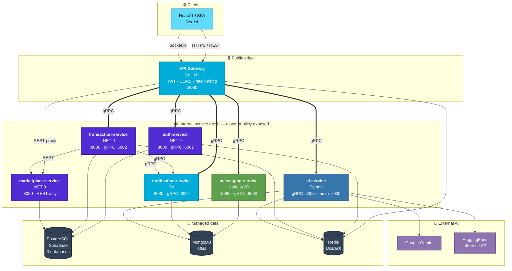
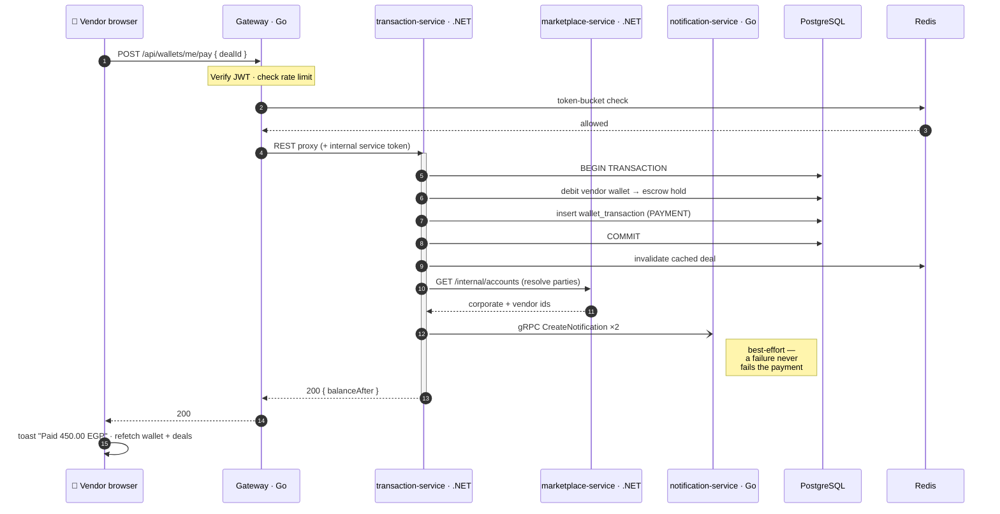
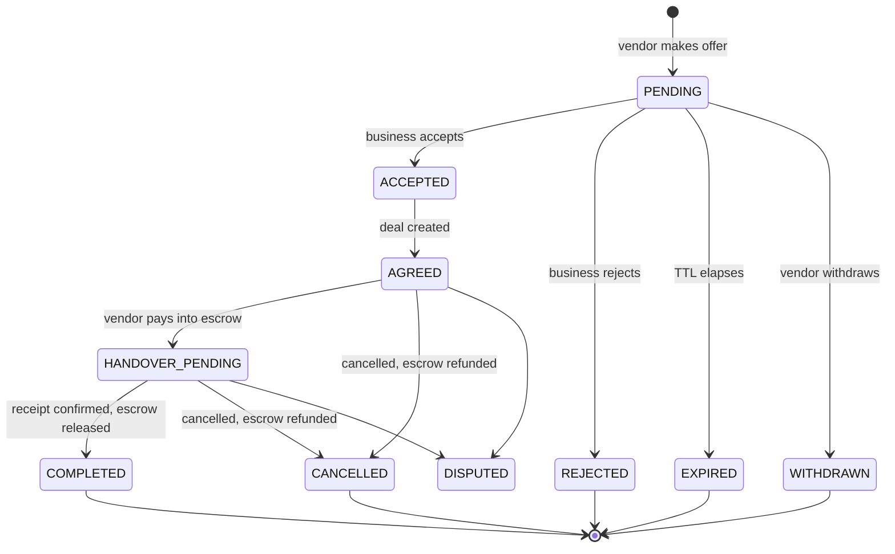
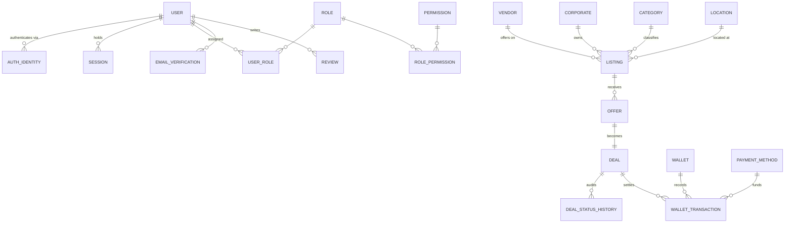
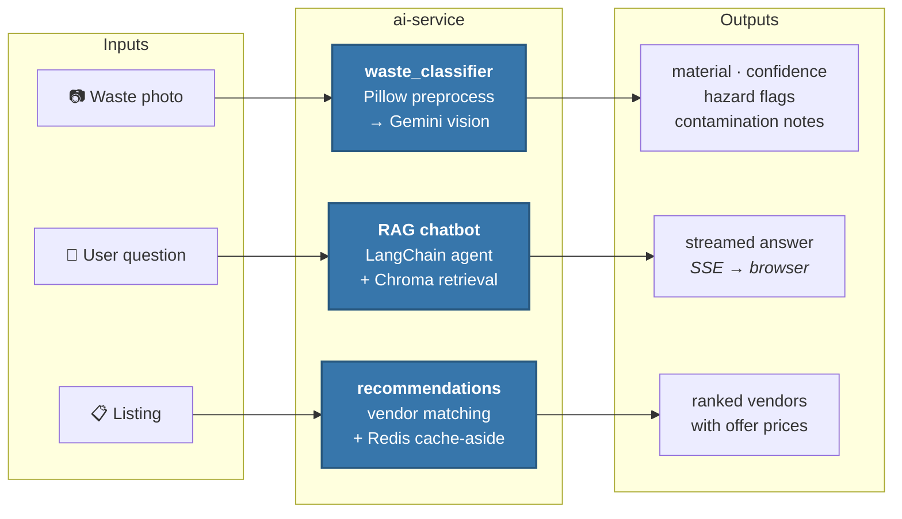
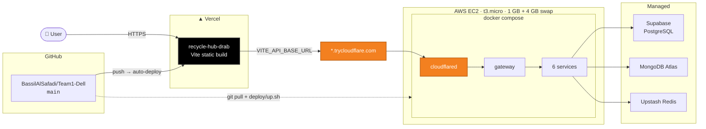
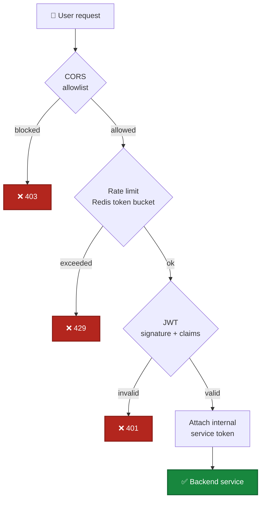

<div align="center">

# ♻️ RecycleHub

### Circular Economy Marketplace

**A polyglot microservices marketplace that turns industrial and commercial waste into traded value.**
Businesses list the waste they produce; vendors discover it, bid on it, collect it, and pay for it
through an escrow-backed wallet — with an AI assistant that classifies waste from a photo and
recommends who to sell it to.

<br/>

[](https://react.dev)
[](https://www.typescriptlang.org)
[](https://vite.dev)
[](https://dotnet.microsoft.com)
[](https://go.dev)

[](https://nodejs.org)
[](https://www.python.org)
[](https://grpc.io)
[](https://www.docker.com)
[](https://www.postgresql.org)

[](https://www.mongodb.com/atlas)
[](https://redis.io)
[](https://supabase.com)
[](https://ai.google.dev)
[](https://www.langchain.com)

[](https://vercel.com)
[](https://aws.amazon.com/ec2/)
[](https://www.cloudflare.com)
[](https://socket.io)

</div>

---

## Table of contents

- [What this is](#what-this-is)
- [System architecture](#system-architecture)
- [The services](#the-services)
- [Technology stack](#technology-stack)
- [How a request flows](#how-a-request-flows)
- [Data model](#data-model)
- [The AI service](#the-ai-service)
- [Repository layout](#repository-layout)
- [Running it locally](#running-it-locally)
- [Configuration](#configuration)
- [Deployment](#deployment)
- [Security model](#security-model)
- [Project stats](#project-stats)

---

## What this is

A **circular economy marketplace**: a two-sided platform connecting waste-producing businesses
with recycling vendors.

| Role | What they do |
|---|---|
| 🏢 **Business** (corporate) | Lists waste (type, quantity, condition), receives offers from vendors, accepts one, hands over the material, gets paid. |
| 🚚 **Vendor** | Browses open requests, makes priced offers, pays into escrow, collects the material, confirms receipt. |

The full lifecycle — **listing → offer → accept → deal → escrow payment → handover → completion →
payout** — is implemented end to end, with an in-app wallet that moves real balances between the
two parties at each stage.

**On top of that sits an AI layer:** upload a photo of your waste and Gemini classifies the
material, flags hazards and contamination, and estimates quantity; a RAG chatbot answers
questions grounded in recycling reference documents; and a vendor-recommendation engine matches
listings to buyers.

### Live

| | |
|---|---|
| **Frontend** | [recycle-hub-drab.vercel.app](https://recycle-hub-drab.vercel.app) — auto-deploys from `main` |
| **Backend** | AWS EC2 `t3.micro`, exposed via a Cloudflare quick tunnel (URL is ephemeral — see [Deployment](#deployment)) |

---

## System architecture

Seven processes: **one gateway** plus **six services**, in five languages, talking over
**gRPC** internally and **REST** externally. The gateway is the *only* publicly reachable
process — every backend port stays on the internal Docker network.



### Why a gateway

Every piece of end-user authentication lives in the gateway. Backend services only accept
**internal mesh credentials** (a shared `INTERNAL_SERVICE_TOKEN`), never raw user JWTs — so a
published backend port would route around authentication entirely. That's why `docker-compose.yml`
uses `expose:` (network-internal) rather than `ports:` (host-published) for all six services.

The gateway uses a **dual transport strategy**: each backend gets a REST reverse-proxy mount as
the fallback, with specific routes overridden to call a real gRPC RPC where one exists. chi's
radix-tree routing naturally prefers a literal route over a wildcard mount, so registering both
for the same prefix is enough for the gRPC route to win.

---

## The services

| Service | Language | Transport | Datastore | Responsibility |
|---|---|---|---|---|
| **gateway** | Go 1.25 · chi | REST in, gRPC + REST out | Redis | Single public entry point. JWT verification, CORS, token-bucket rate limiting, request routing, health aggregation. |
| **auth-service** | C# / .NET 9 | REST + gRPC `:6001` | PostgreSQL | Registration, login, JWT issue/refresh, Google Sign-In, email verification (6-digit codes), password reset, roles & permissions, vendor reviews. |
| **marketplace-service** | C# / .NET 9 | REST only | PostgreSQL | Waste listings, categories, vendor & corporate profiles, locations, search/filter. |
| **transaction-service** | C# / .NET 9 | REST + gRPC `:6002` | PostgreSQL | Offers, deals, deal-status state machine, wallets, wallet transactions, escrow hold/release/refund, payment methods. |
| **messaging-service** | Node.js 20 · Express | REST + gRPC `:6003` + Socket.io | MongoDB | Conversations between businesses and vendors, participants, message history, realtime delivery. |
| **notification-service** | Go 1.25 · chi | REST + gRPC `:6004` | MongoDB | Per-user notification feed, unread counts, read receipts. Other services publish into it over gRPC. |
| **ai-service** | Python · LangChain | gRPC `:6005` (no REST) | MongoDB + Chroma | Waste image classification, RAG chatbot with streaming, vendor recommendations, vendor search. |

### Architecture patterns

Each .NET service follows **Clean Architecture**, split into three projects:

```
ServiceName.Api             ← controllers, contracts, middleware, gRPC servers
ServiceName.Domain          ← entities, pure domain logic, no dependencies
ServiceName.Infrastructure  ← EF Core persistence, options, external adapters
```

The service mesh is **full-mesh over gRPC**: every service holds generated client stubs for every
peer, from a single shared contract directory at [`proto/`](proto/). Six `.proto` files
(`auth`, `transaction`, `messaging`, `notification`, `ai`, `health`) are the one source of truth —
.NET generates at build time via `Grpc.Tools`, Node loads them at runtime via
`@grpc/proto-loader`, and Go/Python check in their generated stubs.

---

## Technology stack

<table>
<tr><td valign="top" width="50%">

### Frontend
<p>


</p>

- Hand-written CSS, no UI framework
- Token-based design system in `index.css`
- SSE streaming for the AI chatbot
- `react-markdown` + `remark-gfm`

</td><td valign="top" width="50%">

### Backend
<p>


</p>

- EF Core, ASP.NET Core Web API
- chi router, `golang-jwt`
- Express, Mongoose, Socket.io
- Protocol Buffers, `grpc-health-check`

</td></tr>
<tr><td valign="top">

### Data
<p>


</p>

- Database-per-service, no cross-DB joins
- Supabase Supavisor session pooler
- MongoDB Atlas for document stores
- Redis cache-aside + rate limiting

</td><td valign="top">

### AI & infra
<p>


</p>

- Chroma vector store for RAG
- Docker Compose orchestration
- Cloudflare Tunnel ingress
- AWS EC2 free tier hosting

</td></tr>
</table>

---

## How a request flows

A vendor paying for an agreed deal — the most cross-cutting operation in the system:



### The deal state machine



Escrow is **atomic with the status transition** — `WalletService.ReleaseEscrowAsync` /
`RefundEscrowAsync` join the same EF Core database transaction as the deal update rather than
opening their own, so a deal can never complete without its payout landing.

---

## Data model

The governing rule, from [`Artifacts/circular-economy-marketplace-eerds.pdf`](Artifacts/):
**database-per-service, no cross-database foreign keys.** Cross-service references are plain
external IDs, resolved through the owning service's API at read time — never joined.



| Database | Engine | Owned by | Core tables / collections |
|---|---|---|---|
| **Auth DB** | PostgreSQL | auth-service | `users`, `auth_identity`, `session`, `role`, `permission`, `role_permission`, `user_role`, `email_verification`, `password_reset`, `review` |
| **Marketplace DB** | PostgreSQL | marketplace-service | `vendor`, `corporate`, `listing`, `category`, `location` |
| **Transaction DB** | PostgreSQL | transaction-service | `wallet`, `wallet_transaction`, `payment_method`, `offer`, `deal`, `deal_status_history` |
| **Messaging** | MongoDB | messaging-service | `conversations`, `conversation_participants`, `messages` |
| **Notifications** | MongoDB | notification-service | `notifications` (polymorphic `entity: {type, id}` target) |
| **AI** | MongoDB + Chroma | ai-service | classification results, chat threads, vector store |

SQL migrations live under each service's `db/migrations/`.

---

## The AI service

The only Python service, and the only one with **no REST API at all** — every route is gRPC,
proxied by the gateway under `/api/ai/*`.



**Key characteristics:**

- **Streaming chat** — `ChatStream` is a server-streaming RPC; the gateway converts it to
  Server-Sent Events, so replies render token-by-token in the browser.
- **Key rotation & fallback** — `gemini_keys.py` rotates between a primary and fallback API key;
  a mid-stream model fallback emits a `reset` event so the client discards the partial reply.
- **Embeddings via HTTP** — uses the HuggingFace Inference API rather than local `torch`, which
  is what lets the whole mesh fit on a 1 GB `t3.micro`.
- **RAG ingestion is a manual prerequisite** — the vector store is built from PDFs placed in
  `data/source_pdfs/` (gitignored). One source is Arabic and needs per-page Gemini-vision OCR,
  cached to `data/ocr_cache/`. Run `python -m chatbot.ingest` before `python -m chatbot.chat`.
- ⚠️ **Guardrails are prompt-only** — the sole safety mechanism is an instruction inside
  `SYSTEM_PROMPT` in `chatbot/agent.py`. There is no moderation API or code-level filter.

---

## Repository layout

```
Team1-Dell/
├── Frontend/Recyclehub/          # React 19 + TypeScript + Vite SPA
│   ├── src/pages/                #   13 routed pages (business + vendor variants)
│   ├── src/components/           #   Navbar, modals, toasts, chatbot widget
│   └── src/lib/                  #   api client, auth context, toast bus, useModal
│
├── gateway/                      # Go — the single public entry point
│   ├── cmd/server/               #   main
│   └── internal/                 #   router, handlers, middleware, proxy, ratelimit
│
├── services/
│   ├── auth-service/             # .NET 9  · Clean Architecture · PostgreSQL
│   ├── marketplace-service/      # .NET 9  · Clean Architecture · PostgreSQL
│   ├── transaction-service/      # .NET 9  · Clean Architecture · PostgreSQL
│   ├── messaging-service/        # Node 20 · Express + Mongoose + Socket.io
│   ├── notification-service/     # Go      · chi + MongoDB driver
│   └── ai-service/               # Python  · LangChain + Gemini + Chroma
│
├── proto/                        # Shared gRPC contracts — single source of truth
│   ├── auth/v1/  transaction/v1/  messaging/v1/
│   └── notification/v1/  ai/v1/  health/v1/
│
├── deploy/                       # VM bootstrap, compose launcher, demo seed script
├── infra/cloudflare-tunnel/      # Per-service tunnel configs (future multi-host setup)
├── Artifacts/                    # System-wide EERD design document (PDF)
│
├── docker-compose.yml            # Dev mesh — gateway published, services internal only
├── docker-compose.prod.yml       # Prod overlay — adds cloudflared, restart policies
├── Dockerfile                    # Single-container build (all 7 processes + supervisord)
└── run-services.sh               # Bare-metal launcher, no Docker
```

### Supporting documents

| Document | Contents |
|---|---|
| [`CLAUDE.md`](CLAUDE.md) | Repo conventions, gotchas, per-service build commands |
| [`SECURITY_AUDIT.md`](SECURITY_AUDIT.md) | Full security review with findings and remediations |
| [`WIRING_SUMMARY.md`](WIRING_SUMMARY.md) | How the services were connected end to end |
| [`REDIS_INTEGRATION_PLAN.md`](REDIS_INTEGRATION_PLAN.md) | Caching strategy and key design |
| [`deploy/README.md`](deploy/README.md) | Step-by-step cloud deployment guide |
| [`services/transaction-service/EERD.md`](services/transaction-service/EERD.md) | Transaction domain schema design |

---

## Running it locally

### Prerequisites

<p>


</p>

Databases are **external managed services** (Supabase, MongoDB Atlas, Upstash Redis) — there are
no local database containers. You need credentials for those before anything will start.

### 1 · Configure

Every service ships a `.env.example`. Copy each one to `.env` in the same directory and fill it in:

```bash
cp gateway/.env.example gateway/.env
for s in ai auth marketplace messaging notification transaction; do
  cp services/$s-service/.env.example services/$s-service/.env
done
cp Frontend/Recyclehub/.env.example Frontend/Recyclehub/.env
```

> [!IMPORTANT]
> `Jwt__SigningKey` / `JWT_SIGNING_KEY` and `Internal__ServiceToken` / `INTERNAL_SERVICE_TOKEN`
> must be **byte-identical across every service**. A mismatch surfaces as `Unauthenticated` gRPC
> errors or silently rejected JWTs — not a crash, which makes it easy to misdiagnose.

> [!NOTE]
> The Supabase connection string must use the **Supavisor session-mode pooler** host, not
> `db.<ref>.supabase.co` — the direct host is IPv6-only and most dev/CI environments have no
> IPv6 route.

### 2 · Run the whole mesh

```bash
docker compose up --build
```

Gateway on **`http://localhost:8080`**. All six services stay on the internal network.

### 3 · Run the frontend

```bash
cd Frontend/Recyclehub
npm install
npm run dev
```

Vite dev server on **`http://localhost:5173`**, pointed at `VITE_API_BASE_URL`.

### Alternatives

<details>
<summary><b>Bare metal, no Docker</b></summary>

```bash
./run-services.sh
```

Ports: gateway `9080`, auth `9081`, transaction `9082`, marketplace `9083`, messaging `9084`,
notification `9085`; gRPC `6001`–`6005`; ai-service mesh HTTP `7005`.

</details>

<details>
<summary><b>Individual services</b></summary>

```bash
# .NET services
dotnet run --project services/auth-service/src/AuthService.Api

# Go services
go run ./cmd/server              # from gateway/ or services/notification-service/

# Node
npm run dev                      # from services/messaging-service/

# Python AI CLIs
python -m chatbot.ingest         # build the vector store first
python -m chatbot.chat           # interactive RAG chatbot
python waste_classifier.py       # image classification demo
```

</details>

<details>
<summary><b>Seed demo data</b></summary>

```bash
bash deploy/seed/run-seed.sh              # 15 vendors + 15 businesses, idempotent
bash deploy/seed/run-seed.sh --purge      # remove everything it created
```

Seeded accounts are real, email-verified and signed-in-able, all sharing one password.

</details>

### Linting

```bash
cd Frontend/Recyclehub && npm run lint    # ESLint + typescript-eslint
cd services/ai-service && ruff check .    # Ruff, line-length 100
dotnet build                              # .NET analyzers run automatically
```

There is **no test framework or CI** configured in this repository.

---

## Configuration

<details>
<summary><b>Environment variables by service</b> (click to expand)</summary>

| Service | Variables |
|---|---|
| **gateway** | `PORT` · `JWT_ISSUER` · `JWT_AUDIENCE` · `JWT_SIGNING_KEY` · `CORS_ORIGINS` · `{AUTH,TRANSACTION,MESSAGING,NOTIFICATION,AI}_GRPC_ADDR` · `{...}_REST_ADDR` · `MARKETPLACE_REST_ADDR` · `REDIS_URL` · `RATE_LIMIT_RPS` · `RATE_LIMIT_BURST` · `INTERNAL_SERVICE_TOKEN` · `TRUSTED_PROXIES` |
| **auth-service** | `ConnectionStrings__AuthDb` · `Jwt__*` · `Google__ClientId` · `Smtp__*` · `EmailVerification__*` · `Grpc__Port` · `Grpc__Peers__*` · `Redis__ConnectionString` · `Internal__ServiceToken` |
| **marketplace-service** | `ConnectionStrings__MarketplaceDb` · `Jwt__*` · `Internal__ServiceToken` |
| **transaction-service** | `ConnectionStrings__TransactionDb` · `Jwt__*` · `Grpc__Port` · `Grpc__Peers__*` · `Redis__ConnectionString` · `Internal__ServiceToken` · `Internal__MarketplaceRestAddr` |
| **messaging-service** | `PORT` · `MONGODB_*` · `MONGO_DB_NAME` · `JWT_*` · `CORS_ORIGINS` · `GRPC_PORT` · `*_GRPC_ADDR` · `REDIS_URL` · `INTERNAL_SERVICE_TOKEN` |
| **notification-service** | `PORT` · `MONGODB_*` · `MONGO_DB_NAME` · `JWT_*` · `CORS_ORIGINS` · `GRPC_PORT` · `*_GRPC_ADDR` · `REDIS_URL` · `INTERNAL_SERVICE_TOKEN` |
| **ai-service** | `GEMINI_API_KEY` · `GEMINI_API_KEY_FALLBACK` · `GEMINI_CHAT_MODEL` · `HUGGINGFACEHUB_API_TOKEN` · `EMBEDDING_MODEL_NAME` · `CHUNK_SIZE` · `CHUNK_OVERLAP` · `MONGODB_*` · `GRPC_PORT` · `MESH_HTTP_PORT` · `REDIS_URL` · `INTERNAL_SERVICE_TOKEN` |
| **frontend** | `VITE_API_BASE_URL` · `VITE_GOOGLE_CLIENT_ID` |

</details>

> [!WARNING]
> All `.env` files are gitignored and hold real credentials. Transfer them between machines
> directly (e.g. `scp`) — never paste them into a web form, chat, or issue tracker.

---

## Deployment



| Tier | Platform | Trigger |
|---|---|---|
| **Frontend** | Vercel (project `recycle-hub`) | Automatic on push to `main` |
| **Backend** | AWS EC2 `t3.micro` + Cloudflare quick tunnel | Manual: `git pull && bash deploy/up.sh` |
| **Databases** | Supabase · MongoDB Atlas · Upstash | Managed |

**Cost: $0/month** — everything runs on free tiers.

> [!IMPORTANT]
> **The tunnel URL is ephemeral.** A Cloudflare *quick* tunnel gets a new random
> `*.trycloudflare.com` hostname every time the `cloudflared` container restarts. When that
> happens you must update `VITE_API_BASE_URL` in the Vercel project settings and redeploy the
> frontend, or every API call will fail while the UI still renders fine.
>
> For a permanent hostname, register a domain, add it to Cloudflare, and switch
> `docker-compose.prod.yml` to a **named** tunnel with a token.

Full walkthrough — instance setup, swap configuration, secret transfer, operations runbook —
in **[`deploy/README.md`](deploy/README.md)**.

<details>
<summary><b>Single-container deployment (Hugging Face Spaces)</b></summary>

The root [`Dockerfile`](Dockerfile) + [`supervisord.conf`](supervisord.conf) bundle all seven
processes into one image for platforms that run a single container. See
[`deploy/huggingface-space.md`](deploy/huggingface-space.md) for the required Space secrets.

Builds must run **serially** (`COMPOSE_PARALLEL_LIMIT=1`, already baked into `deploy/up.sh`) —
parallel NuGet restores drop connections on a 1 GB box.

</details>

---

## Security model



| Control | Implementation |
|---|---|
| **Authentication** | JWT access tokens + refresh tokens; silent refresh on 401 with a single in-flight refresh shared across concurrent requests |
| **Password storage** | Argon2id |
| **Email verification** | 6-digit codes, 15-minute TTL, stored in Redis as SHA-256 hashes (`authverify:{userId}`) — never plaintext |
| **Federated login** | Google Sign-In (ID-token verification) |
| **Authorization** | Role/permission tables (`VENDOR`, `CORPORATE`); ownership enforced server-side |
| **Mesh isolation** | Backend services reject user JWTs; only a shared `INTERNAL_SERVICE_TOKEN` is accepted |
| **Rate limiting** | Redis token bucket, keyed on real client IP |
| **IP spoofing** | chi's `RealIP` middleware deliberately **not** used — `X-Forwarded-For` is only trusted from configured `TRUSTED_PROXIES` |
| **CORS** | Explicit allowlist, required at startup — no wildcard fallback, so a misconfigured deploy fails loudly |
| **Ownership scoping** | `/api/deals/mine` and `/api/offers/mine` replaced earlier `party/{id}` routes that let any authenticated user enumerate other users' records |

See [`SECURITY_AUDIT.md`](SECURITY_AUDIT.md) for the complete review.

---

## Project stats

| | |
|---|---|
| **Languages** | 5 (C#, Go, TypeScript, JavaScript, Python) |
| **Services** | 7 processes (1 gateway + 6 services) |
| **Databases** | 3 PostgreSQL + 3 MongoDB stores + Redis |
| **gRPC contracts** | 6 `.proto` files, 12 RPCs (10 domain + 2 health) |
| **Frontend** | ~10,500 lines · 13 routes · 2 role variants |
| **Backend** | ~15,200 lines across all services + gateway |

<details>
<summary><b>Lines of code by service</b></summary>

| Component | Language | Lines |
|---|---|---:|
| Frontend | TypeScript / CSS | 10,517 |
| ai-service | Python | 4,528 |
| transaction-service | C# | 3,103 |
| auth-service | C# | 2,660 |
| gateway | Go | 1,501 |
| marketplace-service | C# | 1,374 |
| messaging-service | JavaScript | 1,047 |
| notification-service | Go | 1,006 |

*Excludes generated gRPC stubs, build output, and dependencies.*

</details>

### Conventions

- **Commits** — short, descriptive, free-form. No Conventional Commits prefix.
- **Branches** — feature-named (`Transactions`, `ux-ui-polish`, `AI-Features-Wireframe-and-Auth`).
- **Style** — root `.editorconfig` covers Python, C#, JSON/YAML and Markdown.

---

<div align="center">

**Team 1 · Dell Technologies Internship**

<sub>Built with ♻️ for a circular economy</sub>

</div>
