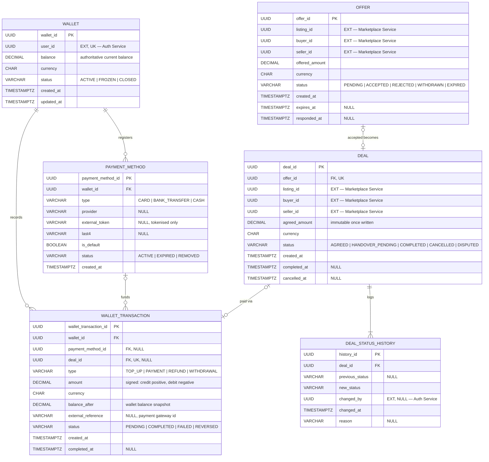

# Transaction DB — EERD

Transaction Service · PostgreSQL · owns this database exclusively (`db-per-service`, no shared
tables, no cross-database foreign keys — see `Artifacts/circular-economy-marketplace-eerds.pdf`
for the system-wide governing rules and notation key).

This extends the Transaction DB design already sketched in that PDF (**EERD 3**, page 6 —
`OFFER → DEAL → DEAL_STATUS_HISTORY`, the Listing→Offer→Deal→Handover flow) with the wallet
flow, which that document does not cover. Two transaction shapes live in this database:

1. **Local business ↔ vendor deals** — an offer on a marketplace listing that, once accepted,
   becomes a deal with immutable terms and an append-only status trail. (Unchanged from EERD 3.)
2. **Wallet activity** — a user topping up their wallet, and the wallet being debited to pay for
   a deal. (New in this document.)

## Notation

Same Crow's Foot conventions as the rest of the system's EERDs:

| Marker | Meaning |
|---|---|
| `PK` | Primary key (underlined in prose) |
| `FK` | Foreign key — always within this same database |
| `UK` | Unique constraint |
| `EXT` | External service reference — plain immutable ID, **no** FK, no join, no cascade |
| `NULL` | Nullable attribute — everything else is `NOT NULL` |

Cardinality reads at the end nearest the entity: `1` exactly one, `0..1` zero or one, `0..N` zero
or more, `1..N` one or more. Solid lines are physical FKs inside this database; dashed lines are
external service references.

## Diagram

## Entities

### WALLET — strong entity, one per user

- `PK wallet_id UUID`
- `EXT user_id UUID` — Auth Service `USER.user_id`, no physical FK. `UNIQUE(user_id)`: at most
  one wallet per account.
- `balance DECIMAL(14,2)` — the authoritative current balance, **not** a derived/cached value.
  It must be updated in the same database transaction as the `WALLET_TRANSACTION` row that
  changes it, so the two never disagree.
- `currency CHAR(3)`
- `status VARCHAR(16)` — `ACTIVE | FROZEN | CLOSED`
- `created_at`, `updated_at TIMESTAMPTZ`

### PAYMENT_METHOD — strong entity, funding sources for top-ups

- `PK payment_method_id UUID`
- `FK wallet_id UUID`
- `type VARCHAR(16)` — `CARD | BANK_TRANSFER | CASH`
- `provider VARCHAR(50) NULL` — e.g. the payment gateway name
- `external_token VARCHAR(255) NULL` — a tokenised reference from the payment provider; **raw
  card/bank details are never stored here**
- `last4 VARCHAR(4) NULL`
- `is_default BOOLEAN`
- `status VARCHAR(16)` — `ACTIVE | EXPIRED | REMOVED`
- `created_at TIMESTAMPTZ`

### WALLET_TRANSACTION — dependent entity, append-only ledger

- `PK wallet_transaction_id UUID`
- `FK wallet_id UUID`
- `FK payment_method_id UUID NULL` — set only when `type = TOP_UP`, naming the funding source
- `FK deal_id UUID NULL` — set only when `type = PAYMENT`, naming which deal this paid for.
  `UNIQUE(deal_id)` where not null: a deal can be paid from the wallet at most once.
- `type VARCHAR(16)` — `TOP_UP | PAYMENT | REFUND | WITHDRAWAL`
- `amount DECIMAL(14,2)` — signed: `TOP_UP`/`REFUND` are positive (credit), `PAYMENT`/
  `WITHDRAWAL` are negative (debit). `CHECK (amount <> 0)`.
- `currency CHAR(3)`
- `balance_after DECIMAL(14,2)` — snapshot of `WALLET.balance` immediately after this row was
  applied, so the ledger can be replayed to audit or reconstruct the wallet balance.
- `external_reference VARCHAR(255) NULL` — the payment gateway's own transaction id, for
  reconciliation
- `status VARCHAR(16)` — `PENDING | COMPLETED | FAILED | REVERSED`
- `created_at TIMESTAMPTZ`, `completed_at TIMESTAMPTZ NULL`

Append-only, same discipline as `DEAL_STATUS_HISTORY`: a row is never edited or deleted once
`COMPLETED`. Reversing a completed transaction (e.g. a top-up charge that later bounces) inserts
a new compensating row rather than mutating the original — the ledger stays a truthful history of
what happened, not just the current state.

### OFFER, DEAL, DEAL_STATUS_HISTORY — unchanged from EERD 3

Carried over as-is from `Artifacts/circular-economy-marketplace-eerds.pdf` (page 6). `buyer_id`
and `seller_id` are external references to `VENDOR.vendor_id` / `CORPORATE.corporate_id` in the
Marketplace DB — this is the "local business dealing with a vendor" flow. See that document for
the full field-by-field rationale; it isn't repeated here to avoid the two documents drifting out
of sync on the parts that haven't changed.

## Relationships

| From | To | Cardinality | Notes |
|---|---|---|---|
| WALLET | WALLET_TRANSACTION | 1 : 0..N | every ledger row belongs to exactly one wallet |
| WALLET | PAYMENT_METHOD | 1 : 0..N | a user may register multiple funding sources |
| PAYMENT_METHOD | WALLET_TRANSACTION | 0..1 : 0..N | only `TOP_UP` rows reference one |
| DEAL | WALLET_TRANSACTION | 0..1 : 0..1 | only `PAYMENT` rows reference one; a deal may instead be settled outside the wallet system |
| OFFER | DEAL | 1 : 0..1 | unchanged from EERD 3 — an accepted offer yields at most one deal |
| DEAL | DEAL_STATUS_HISTORY | 1 : 1..N | unchanged from EERD 3 — append-only audit trail |

## Cross-service references (external, no physical FK)

| Field | Owning service | Entity |
|---|---|---|
| `WALLET.user_id` | Auth Service | `USER.user_id` |
| `OFFER.listing_id`, `DEAL.listing_id` | Marketplace Service | `LISTING.listing_id` |
| `OFFER.buyer_id` / `seller_id`, `DEAL.buyer_id` / `seller_id` | Marketplace Service | `VENDOR.vendor_id` / `CORPORATE.corporate_id` |
| `DEAL_STATUS_HISTORY.changed_by` | Auth Service | `USER.user_id` |

## Deliberately not modelled (yet)

- Wallet-to-wallet transfers between users
- Multi-currency conversion (a wallet holds exactly one `currency`)
- Escrow / holds on wallet balance during an in-progress deal
- Routing a `REFUND` back to a specific original `PAYMENT_METHOD` (currently just a signed ledger
  entry against the wallet)

These can be added additively later without breaking the shape above; call them out explicitly if
a requirement needs one of them.
